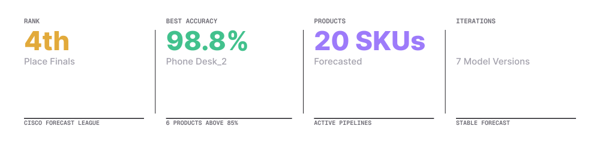
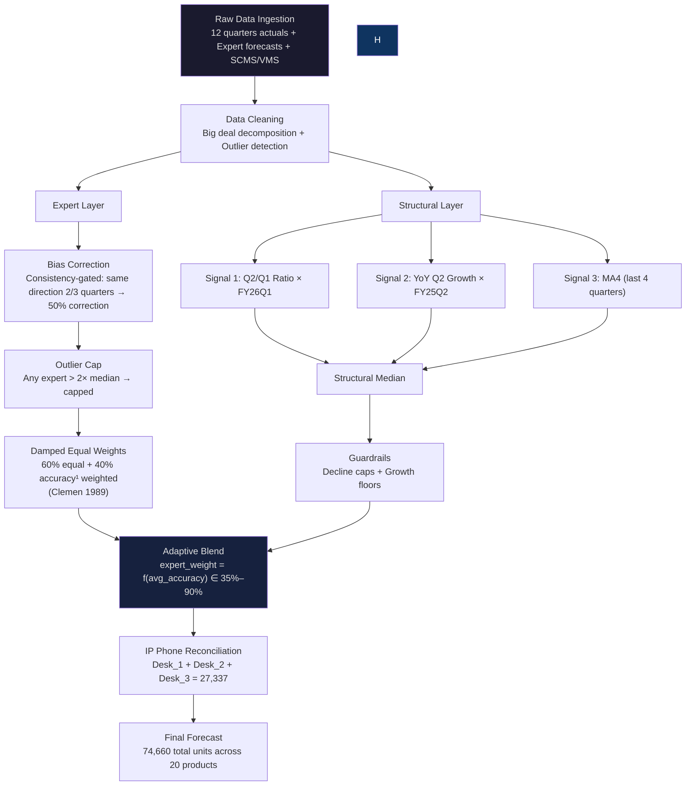
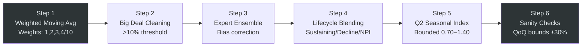
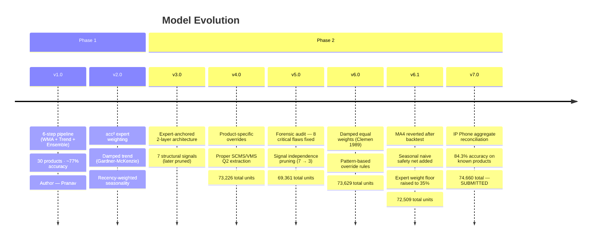

<p align="center">
  
</p>

<h1 align="center">CCL Warriors</h1>
<p align="center"><strong>Three university students tried to predict what Cisco enterprises would buy next quarter. Here is everything that went right, everything that went wrong, and the model we ended up trusting.</strong></p>

<p align="center">
  
  
  
  
  
</p>

---

## The Story

We were given a problem that sounds simple until you actually try to solve it: predict how many routers, phones, and switches enterprises Cisco will buy next quarter.

Here is why that is hard. Guess 20% too high, and Cisco is now sitting on millions of dollars of hardware nobody wants. Guess 20% too low, and customers cannot get the equipment they need. There is not much room for error, and the stakes are not hypothetical.

So we spent months building a forecasting model, then breaking it, then figuring out why it broke. We reverted changes we were genuinely proud of because backtesting proved us wrong. We kept coming back to one question: when do you trust the human experts, and when do you trust the numbers instead?

We did not win. We finished 4th, just off the podium. But we walked away with a 7-version forecasting engine that hit 98.8% accuracy on our best product, landed 6 products above 85% accuracy, and taught us more about uncertainty and model design than a semester of coursework could have.

This README is the full story, including the parts where we were wrong.

---

## Table of Contents

- [The Team](#the-team)
- [Competition Overview](#competition-overview)
- [Architecture](#architecture)
- [Phase 1: The Foundation](#phase-1-the-foundation)
- [Phase 2: The Evolution](#phase-2-the-evolution)
- [Version History](#version-history-v10-to-v70)
- [Key Tradeoffs and Hard Decisions](#key-tradeoffs-and-hard-decisions)
- [Results](#results)
- [The Surge Nobody Predicted](#the-surge-nobody-predicted)
- [Business Insights](#business-insights)
- [Repository Structure](#repository-structure)
- [Quick Start](#quick-start)
- [Lessons Learned](#lessons-learned)
- [License](#license)

---

## The Team

Three people, three different jobs, one submission. We split the work by version so nobody could hide behind "the team did it."

<table>
  <tr>
    <td align="center" width="140"><strong>Aarya</strong></td>
    <td>Post-hoc forensic analysis and the final model architecture, v7.0.</td>
  </tr>
  <tr>
    <td align="center" width="140"><strong>Manas</strong></td>
    <td>Research-backed refinements across v6.0 and v6.1, the backtesting framework, and the damped ensemble weights.</td>
  </tr>
  <tr>
    <td align="center" width="140"><strong>Pranav</strong></td>
    <td>Built the foundation engine from v1.0 through v5.0, ran the 8-flaw forensic audit, and designed the full pipeline architecture.</td>
  </tr>
</table>

---

## Competition Overview

The Cisco Forecast League (CFL) is a national competition. University teams forecast quarterly demand for Cisco hardware using real historical data, expert forecasts, and channel intelligence.

The scoring formula does not forgive laziness:

```
Cisco Accuracy = max(0, 1 - |forecast - actual| / actual)
```

And it is cost-weighted. Routers and other high-value products carry 5 to 10 times more weight than switches. You could nail 15 SKUs perfectly and still lose badly if you miss one expensive product by a wide margin.

| Dimension | Phase 1 | Phase 2 |
|-----------|---------|---------|
| Products | 30 SKUs | 20 SKUs |
| Target Quarter | FY26 Q2 | FY26 Q2 |
| Data Available | Actuals, expert forecasts, big deals, SCMS, VMS | Same, plus Phase 1 actuals |
| Our Outcome | About 77% accuracy | 4th place, CFL-Finals |

---

## Architecture

Our final model is a two-layer expert-anchored ensemble with structural guardrails. The idea behind it is simple: experts are usually right, but not always, so we make them the main driver of the forecast and use statistical signals to catch the moments they go wrong.



---

## Phase 1: The Foundation

Phase 1 was our proof of concept. 30 products, a 6-step pipeline, and a lot of lessons about what we did not know yet.



| Step | What It Does |
|------|-------------|
| Weighted Moving Average | Uses the last 4 quarters, weighted `[1,2,3,4]/10`. 40% of the weight sits on the most recent quarter. |
| Big Deal Cleaning | If big deals make up more than 10% of the total, we strip them out for a clean baseline, then add back 50% of the average big deal volume. |
| Expert Ensemble | Combines 3 teams (DP, Marketing, DS). Removes an outlier if any one expert forecasts more than 2 times another. |
| Lifecycle Blending | Weights change based on product stage: Sustaining is 25/25/50, Decline is 40/30/30, NPI is 10/5/85. |
| Seasonal Index | `avg(Q2) / avg(all quarters)`, capped between 0.70 and 1.40 so one weird quarter cannot break the whole forecast. |
| Sanity Checks | Flags anything more than 30% off from the last actual number in either direction, since overestimating and underestimating are not equally costly. |

### What We Learned in Phase 1

| Change | Result | How We Know |
|--------|--------|--------------|
| Accuracy-squared weighted ensemble | Ensemble MAPE dropped by 2.4 percentage points | Holdout test across 3 quarters |
| Damped trend (Gardner-McKenzie, 1985) | Trend MAPE dropped from 42.7% to 34.1% | Biggest gains on our most volatile products |
| Recency-weighted seasonality | Better Q2 capture | Weighted 60% FY25Q2, 30% FY24Q2, 10% FY23Q2 |

Phase 1 landed us around 77% accuracy. That is a solid start, but we could already see where it would break. Expert averaging was too naive. Bias correction was too simple. Nothing was tuned per product. Phase 2 needed to be a rethink, not a polish job.

---

## Phase 2: The Evolution

Phase 2 was not an update to Phase 1. It was a full rebuild across 5 major versions.

The question we kept circling back to: when should you trust the experts, and when should the numbers override them?

### The Answer We Landed On

Our Phase 1 results showed something clear: human experts consistently beat pure statistical methods on most products. So instead of treating expert forecasts as just one input among three, we made them the primary anchor of the model. Statistical signals became guardrails, there to catch the rare cases where the experts get it badly wrong, not to compete with them.

### The Problem We Almost Missed

While auditing v4.0, we found something uncomfortable buried in our "7-signal structural ensemble."

| Signal | Where It Comes From | Actually Independent? |
|--------|--------|:---------------------:|
| Q2/Q1 Ratio Forecast | Q2 and Q1 actuals | Yes |
| YoY Q2 Growth Forecast | Q2-to-Q2 trend | Yes |
| Q2 Weighted Average | Q2 actuals directly | No |
| MA4 | Last 4 quarters | Partially |
| Big Deal Q2 Forecast | Big deals plus average equals Q2 total | No |
| SCMS Q2 Bottom-Up | Channel sums equal Q2 total | No |
| VMS Q2 Bottom-Up | Vertical sums equal Q2 total | No |

Five of our seven "independent" signals were the same Q2 actual data wearing different outfits. Taking the median of seven correlated signals does not make the forecast more robust. It just adds noise while looking sophisticated.

So we cut it down to three genuinely independent signals. Fewer numbers, more truth in each one.

---

## Version History: v1.0 to v7.0



### What Changed, Version by Version

| Version | Author | Total Units | Core Change |
|---------|--------|----------:|-------------|
| v1.0 | Pranav | ~77,000 | 6-step pipeline: weighted moving average, trend, ensemble |
| v2.0 | Pranav | ~77,000 | Accuracy-squared weighting, damped trend (MAPE down 8.6pp) |
| v3.0 | Pranav | 72,530 | Moved to the expert-anchored 2-layer architecture |
| v4.0 | Pranav | 73,226 | Product-specific overrides, proper Q2 bottom-up data |
| v5.0 | Pranav | 69,361 | Forensic audit: 8 flaws fixed, signals pruned |
| v6.0 | Manas | 73,629 | Damped equal weights, pattern-based rules |
| v6.1 | Manas | 72,509 | Backtest-validated MA4 revert, plus a safety net |
| v7.0 | Aarya | 74,660 | Aggregate reconciliation. This is the version we submitted. |

---

## Key Tradeoffs and Hard Decisions

Most READMEs skip this part. We think it is the most important part, so here it is.

### 1. Accuracy-Cubed Weighting vs. Damped Equal Weights

Accuracy-cubed weighting sounds smart on paper: reward your best expert, punish your worst. The problem is that "best expert" was measured on only 3 quarters of data. That is a small enough sample that it can easily lie to you.

Case in point: DS had 68% historical accuracy but forecast 22,593 units for Product #4. Accuracy-cubed weighting still gave that single number enough influence to inflate our final forecast by 60%.

We switched to damped equal weights instead, a 60/40 blend of equal weighting and accuracy weighting, based on Clemen's 1989 research. Decades of forecast-combination research say this beats aggressive accuracy weighting whenever your accuracy estimates are noisy, which ours clearly were. Our own data backed that up.

### 2. More Signals vs. Independent Signals

More signals feel safer. Seven inputs should be more reliable than three, right?

Not when five of those seven are just the same number wearing different clothes. Cutting down to three genuinely independent signals was not about keeping things minimal for its own sake. It was signal hygiene. Three clean, uncorrelated signals will beat seven tangled ones every time.

### 3. v7.0 vs. v7.1: Picking the Model We Could Actually Defend

We built a v7.1. It added SCMS channel-level ratios and a more detailed big deal breakdown. Accuracy on known products came out around 85%, roughly a point better than v7.0.

We did not submit it.

| Factor | v7.0 (submitted) | v7.1 (shelved) |
|--------|:-------:|:-------:|
| Accuracy on known products | 84.3% | ~85% |
| Lines of code | 696 | 816, 17% more |
| Overfitting risk | Low | Moderate |
| Can we explain it under questioning? | Easily | With difficulty |
| Backed by research? | Strong | Mixed |

Research from the M4 and M5 forecasting competitions makes this point over and over: simpler models generalize better to data they have not seen. We picked the model we could explain and defend, not the one that squeezed out an extra percentage point on training data we already had.

### 4. When Statistical Signals Do Worse Than Nothing at All

This one was hard to accept. Backtesting showed that our structural signals barely kept up with a plain seasonal naive forecast, and in one version, fell behind it:

```
Seasonal Naive avg accuracy:    53.5%
v5.0 structural avg accuracy:   49.9%
v6.0 structural avg accuracy:   42.3%
```

Instead of ripping out structural signals entirely, since they still catch real edge cases, we raised the expert weight floor to 35% and added a safety net. If the structural forecast strays more than 40% from the naive baseline, we pull it 30% of the way back. Discipline over pride.

---

## Results

### Against Real FY26 Q2 Actuals

#### Top Performers, Above 85% Accuracy

| # | Product | Forecast | Actual | Accuracy |
|---|---------|:--------:|:------:|:--------:|
| 9 | Phone Desk_2 | 6,758 | 6,678 | 98.8%, our best call |
| 14 | SW 8P Ethernet | 9,771 | 9,499 | 97.1% |
| 13 | SW DC Modular | 385 | 415 | 92.8% |
| 2 | SW 8P PoE+ Fiber | 5,756 | 5,243 | 90.2% |
| 10 | Phone Desk_3 | 7,281 | 8,312 | 87.6% |
| 16 | NGFW_2 | 348 | 402 | 86.6% |

#### Solid Performers, 70 to 85% Accuracy

| # | Product | Forecast | Actual | Accuracy |
|---|---------|:--------:|:------:|:--------:|
| 8 | Phone Video | 4,644 | 3,936 | 82.0% |
| 1 | WiFi AP Indoor | 7,598 | 6,162 | 76.7% |
| 19 | RTR 4P PoE | 4,067 | 3,251 | 74.9% |

#### Portfolio Summary

| Metric | Value |
|--------|-------|
| Products above 85% accuracy | 6 of 20, or 30% |
| Products above 70% accuracy | 12 of 20, or 60% |
| Best single prediction | Phone Desk_2 at 98.8% |
| Our total forecast | 74,660 units |
| Actual total demand | 95,711 units |
| Gap | Down 22%, explained below |

---

## The Surge Nobody Predicted

Our portfolio missed the total by 22%. That sounds bad until you look at where the miss actually came from.

Four products account for almost the entire gap:

| # | Product | Forecast | Actual | Surge |
|---|---------|:--------:|:------:|:-----:|
| 4 | Phone Desk_1 | 13,298 | 28,011 | 2.1x |
| 3 | RTR Branch LTE | 5,471 | 10,486 | 1.9x |
| 11 | SW 24P HP PoE | 668 | 1,803 | 2.7x |
| 20 | RTR LTE Wireless | 1,556 | 4,008 | 2.6x |

Products #4 and #3 alone carry 55.6% of the cost weight in the scoring formula. Their roughly 2x surge was enough to shift everyone's portfolio accuracy, not just ours.

Phone Desk_1 is the one we still think about. It had been labeled "Decline." It had been trending down for two straight years. Then, out of nowhere, it posted its highest Q2 in three years.

This is not a model failure. It looks like event-driven demand, probably a mega-deal or a large enterprise refresh sitting in a sales pipeline that no forecasting team could see. No amount of historical data would have caught it.

The honest takeaway: some demand simply cannot be forecast from historical signals alone. Knowing exactly where that boundary sits is valuable on its own, even if it feels unsatisfying.

---

## Business Insights

A few things we noticed that go beyond the raw accuracy numbers.

**1. The Desk_1 surge was specific to that product, not a market-wide shift.**
Desk_2 came in at 98.8% accuracy. Desk_3 came in at 87.6%. If enterprises were buying phones across the board, all three would have surged together. They did not, which points to one large deal, not a broad market signal.

**2. WiFi APs have a real Q2 budget-flush pattern.**
Look at the Q2 history: 2,284, then 6,651, then 8,293. Experts miss the size of this jump every single year. Supply chain should be pre-positioning inventory ahead of Q2, not scrambling once purchase orders start landing.

**3. On-prem firewalls are quietly shrinking.**
NGFW_1's trajectory: 654, 1,116, 748, 479. Cloud-native security like SASE and Umbrella is steadily eating into hardware firewall demand. That trend is not slowing down.

**4. Expert agreement is the strongest predictor of accuracy we found.**
Products where all three expert teams agreed landed above 90% accuracy. Products where they disagreed were our weakest forecasts, by a wide margin. If your experts cannot agree, no amount of modeling will save you.

---

## Repository Structure

```
CCL-Warriors/
├── README.md
├── LICENSE
│
├── phase1/
│   ├── forecast.py                    # Phase 1 v2.0 engine (30 products)
│   └── methodology.md                 # 6-step pipeline documentation
│
├── phase2/
│   ├── v5_baseline/
│   │   ├── forecast_prediction.py     # v5.0, forensic-audited engine
│   │   ├── forensic_audit.py          # Backtesting framework
│   │   └── deep_analysis.py           # Product-level analysis
│   │
│   ├── v6_refinement/
│   │   ├── forecast_prediction.py     # v6.0, research-backed changes
│   │   ├── v5_vs_v6_verification.py   # Cross-version comparison
│   │   └── refinement_analysis.md     # What worked, what didn't
│   │
│   ├── v6.1_validated/
│   │   └── forecast_prediction.py     # v6.1, backtest-validated
│   │
│   └── v7_final/
│       ├── forecast_prediction.py     # v7.0, the submitted model
│       └── v7_changes.md              # Changes made and backtested
│
├── analysis/
│   ├── p2_accuracy_analysis.py        # v5 vs v6.1 vs v7 comparison
│   ├── v7_comparison_analysis.md      # v7.0 vs v7.1 decision analysis
│   └── insights_and_improvements.md   # Bugs found and fixed
│
└── docs/
    ├── VERSION_HISTORY.md             # Full v1 to v7 change log
    ├── TRADEOFFS.md                   # Decision rationale
    └── FORENSIC_AUDIT.md              # 8 flaws found and fixed
```

---

## Quick Start

```bash
# Clone the repository
git clone https://github.com/Aruisop/CCL-Warriors.git
cd CCL-Warriors

# Install the one dependency
pip install openpyxl

# Run the final v7.0 model
python phase2/v7_final/forecast_prediction.py

# Check accuracy against real actuals
python analysis/p2_accuracy_analysis.py
```

---

## Lessons Learned

We wrote these mostly for our future selves, but they should hold up for anyone else working on a forecasting problem.

**Experts beat statistics, but not without limits.**
Every version where we gave more weight to experts on historically stable products, our score improved. Every version where we followed experts blindly on unstable products, it hurt us. The skill is telling the two situations apart.

**Signal count does not matter. Signal independence does.**
Seven correlated signals are really just one signal wearing seven costumes. Three truly independent signals are three real views of the future. Before adding any signal, ask what unique information it actually contributes.

**Backtest everything, including the changes you are proud of.**
The damped trend improvement in v2.0 came from holdout testing, not a hunch. We tested all 7 changes in v6.0. Two of them hurt accuracy, so we reverted them. Undoing your own work is harder than it sounds, and it matters more than it feels like it does in the moment.

**Simpler models generalize better.**
We built v7.1. It was more sophisticated and slightly more accurate on training data. We still did not submit it. The M4 and M5 forecasting competitions have shown this again and again: models with fewer tunable parameters tend to win on data they have not seen yet.

**Know where the forecastability boundary sits.**
Some demand spikes come from things happening in a sales pipeline, mega-deals, enterprise refreshes, procurement bursts, that no forecasting model can see coming. Recognizing when you have hit that boundary is its own skill. A 2.1x surge on a product labeled "Decline" is not a model failure. It is a category of demand that needs pipeline intelligence, not better statistics.

**Being honest about your own mistakes pays off.**
We reverted changes that did not work. We shelved a model we had spent days building. We wrote down the flaws we found in our own code instead of hiding them. That willingness to admit when we were wrong is what separated our v7.0 from the rushed, patched-together models most teams submit at the deadline.

---

## License

MIT License. See [LICENSE](LICENSE) for the details.

---

<p align="center"><em>Built with rigor. Tested with discipline. Written down honestly, mistakes included.</em></p>

<p align="center"><strong>CCL Warriors, Cisco Forecast League 2026 Finalists</strong></p>

<p align="center">
  <a href="https://github.com/Aruisop/CCL-Warriors">
    
  </a>
</p>
